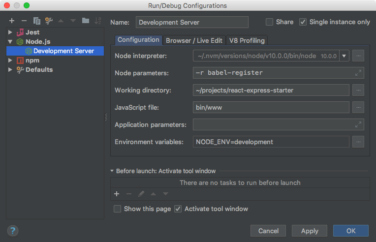
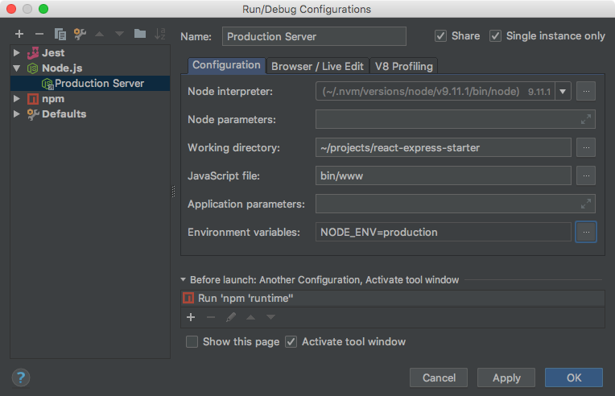

Webstorm Run Configurations
===========================

These are webstorm specific run configurations that make it really simple to work with the project.

Development Server
------------------

Production Server
-----------------

The production server needs to build an optimized runtime that compiles non-compatible syntax
such as JSX into javascript that Node can understand.

This configuration ensures that `npm run runtime` is executed before launching the server.

